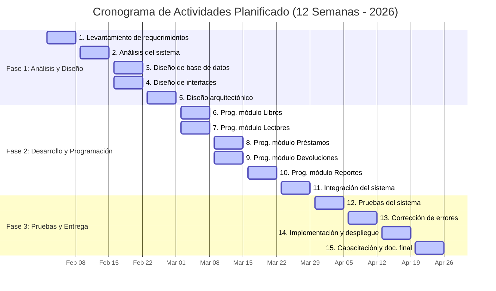
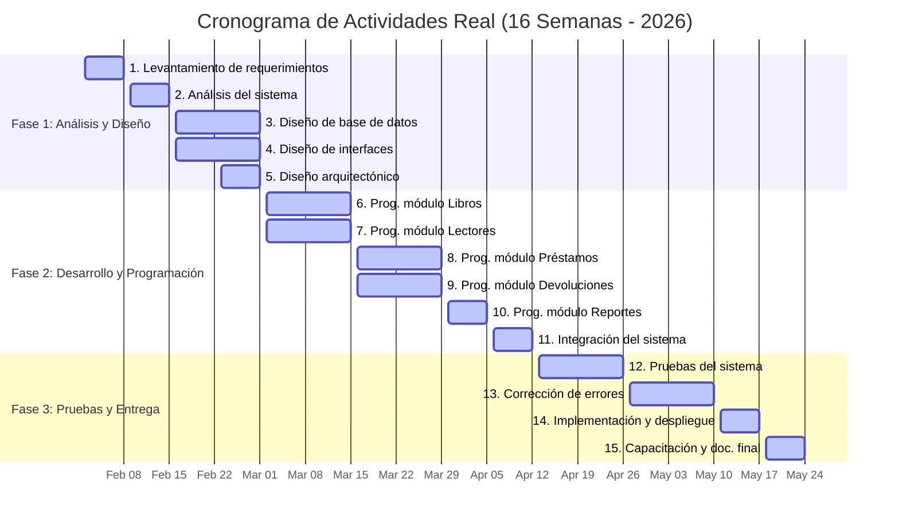

# Cronograma de Actividades del Proyecto (Edición 2026)

Este documento detalla la planificación temporal de las **15 actividades clave** identificadas en el cronograma original. Tomando en cuenta que el desarrollo comenzó a inicios de **Febrero de 2026** y nos encontramos en **Junio de 2026**, se presentan dos perspectivas detalladas para su uso:

1. **Opción A: Cronograma Original Planificado (12 Semanas)**: Ajuste directo del diseño de 12 semanas al calendario de 2026 (finalizando en abril).
2. **Opción B: Cronograma Real Ejecutado / Extendido (16 Semanas)**: Ajuste adaptado para distribuir el esfuerzo a lo largo de los 4 meses completos (Febrero - Mayo) para coincidir con la entrega final en Mayo y el estado actual al 1 de Junio de 2026.

---

## 📅 Calendario de Semanas de Referencia (Año 2026)

Para el cálculo exacto de las fechas, se toma como inicio de actividades el **Lunes 2 de Febrero de 2026** (primer lunes de febrero):

*   **Mes 1 (Febrero 2026):**
    *   **Semana 1:** Del 02 de febrero al 08 de febrero
    *   **Semana 2:** Del 09 de febrero al 15 de febrero
    *   **Semana 3:** Del 16 de febrero al 22 de febrero
    *   **Semana 4:** Del 23 de febrero al 01 de marzo
*   **Mes 2 (Marzo 2026):**
    *   **Semana 5:** Del 02 de marzo al 08 de marzo
    *   **Semana 6:** Del 09 de marzo al 15 de marzo
    *   **Semana 7:** Del 16 de marzo al 22 de marzo
    *   **Semana 8:** Del 23 de marzo al 29 de marzo
*   **Mes 3 (Abril 2026):**
    *   **Semana 9:** Del 30 de marzo al 05 de abril
    *   **Semana 10:** Del 06 de abril al 12 de abril
    *   **Semana 11:** Del 13 de abril al 19 de abril
    *   **Semana 12:** Del 20 de abril al 26 de abril
*   **Mes 4 (Mayo 2026 - Opcional para la versión extendida):**
    *   **Semana 13:** Del 27 de abril al 03 de mayo
    *   **Semana 14:** Del 04 de mayo al 10 de mayo
    *   **Semana 15:** Del 11 de mayo al 17 de mayo
    *   **Semana 16:** Del 18 de mayo al 24 de mayo *(Presentación de Informe Fase II: 22 de Mayo)*

---

## 📈 Opción A: Cronograma Original Planificado (12 Semanas)

Esta versión respeta la duración y paralelismo exacto que se muestra en tu imagen original, proyectando las semanas consecutivas sobre el calendario de 2026.

### 📋 Tabla de Actividades y Fechas (12 Semanas)

| N° | Actividad | Mes / Semana | Fecha Inicio | Fecha Fin | Estado Actual (al 01/06) |
|:---|:---|:---:|:---:|:---:|:---:|
| **1** | Levantamiento de requerimientos | Mes 1 - Sem 1 | 02/Feb/2026 | 08/Feb/2026 | **✔️ Completado** |
| **2** | Análisis del sistema | Mes 1 - Sem 2 | 09/Feb/2026 | 15/Feb/2026 | **✔️ Completado** |
| **3** | Diseño de base de datos | Mes 1 - Sem 3 | 16/Feb/2026 | 22/Feb/2026 | **✔️ Completado** |
| **4** | Diseño de interfaces | Mes 1 - Sem 3 | 16/Feb/2026 | 22/Feb/2026 | **✔️ Completado** |
| **5** | Diseño arquitectónico | Mes 1 - Sem 4 | 23/Feb/2026 | 01/Mar/2026 | **✔️ Completado** |
| **6** | Programación módulo Libros | Mes 2 - Sem 5 | 02/Mar/2026 | 08/Mar/2026 | **✔️ Completado** |
| **7** | Programación módulo Lectores | Mes 2 - Sem 5 | 02/Mar/2026 | 08/Mar/2026 | **✔️ Completado** |
| **8** | Programación módulo Préstamos | Mes 2 - Sem 6 | 09/Mar/2026 | 15/Mar/2026 | **✔️ Completado** |
| **9** | Programación módulo Devoluciones | Mes 2 - Sem 6 | 09/Mar/2026 | 15/Mar/2026 | **✔️ Completado** |
| **10**| Programación módulo Reportes | Mes 2 - Sem 7 | 16/Mar/2026 | 22/Mar/2026 | **✔️ Completado** |
| **11**| Integración del sistema | Mes 2 - Sem 8 | 23/Mar/2026 | 29/Mar/2026 | **✔️ Completado** |
| **12**| Pruebas del sistema | Mes 3 - Sem 9 | 30/Mar/2026 | 05/Abr/2026 | **✔️ Completado** |
| **13**| Corrección de errores | Mes 3 - Sem 10| 06/Abr/2026 | 12/Abr/2026 | **✔️ Completado** |
| **14**| Implementación y despliegue | Mes 3 - Sem 11| 13/Abr/2026 | 19/Abr/2026 | **✔️ Completado** |
| **15**| Capacitación y documentación final | Mes 3 - Sem 12| 20/Abr/2026 | 26/Abr/2026 | **✔️ Completado** |

> [!NOTE]
> En este escenario planificado, el proyecto concluyó exitosamente el **26 de Abril de 2026**. Actualmente el sistema se encuentra en fase de operación o mantenimiento regular.

### 📊 Diagrama de Gantt (12 Semanas)

---

## 📈 Opción B: Cronograma Real Ejecutado / Extendido (16 Semanas)

Ideal si el proyecto tuvo un ritmo adaptado al semestre académico regular (4 meses completos, Febrero a Mayo), cerrando la entrega y la documentación oficial el **22 de Mayo de 2026**, para ingresar a soporte/estabilización activa en Junio.

### 📋 Tabla de Actividades y Fechas (16 Semanas)

| N° | Actividad | Mes / Semana | Fecha Inicio | Fecha Fin | Estado Actual (al 01/06) |
|:---|:---|:---:|:---:|:---:|:---:|
| **1** | Levantamiento de requerimientos | Mes 1 - Sem 1 | 02/Feb/2026 | 08/Feb/2026 | **✔️ Completado** |
| **2** | Análisis del sistema | Mes 1 - Sem 2 | 09/Feb/2026 | 15/Feb/2026 | **✔️ Completado** |
| **3** | Diseño de base de datos | Mes 1 - Sem 3 y 4 | 16/Feb/2026 | 01/Mar/2026 | **✔️ Completado** |
| **4** | Diseño de interfaces | Mes 1 - Sem 3 y 4 | 16/Feb/2026 | 01/Mar/2026 | **✔️ Completado** |
| **5** | Diseño arquitectónico | Mes 1 - Sem 4 | 23/Feb/2026 | 01/Mar/2026 | **✔️ Completado** |
| **6** | Programación módulo Libros | Mes 2 - Sem 5 y 6 | 02/Mar/2026 | 15/Mar/2026 | **✔️ Completado** |
| **7** | Programación módulo Lectores | Mes 2 - Sem 5 y 6 | 02/Mar/2026 | 15/Mar/2026 | **✔️ Completado** |
| **8** | Programación módulo Préstamos | Mes 2 - Sem 7 y 8 | 16/Mar/2026 | 29/Mar/2026 | **✔️ Completado** |
| **9** | Programación módulo Devoluciones | Mes 2 - Sem 7 y 8 | 16/Mar/2026 | 29/Mar/2026 | **✔️ Completado** |
| **10**| Programación módulo Reportes | Mes 3 - Sem 9 | 30/Mar/2026 | 05/Abr/2026 | **✔️ Completado** |
| **11**| Integración del sistema | Mes 3 - Sem 10| 06/Abr/2026 | 12/Abr/2026 | **✔️ Completado** |
| **12**| Pruebas del sistema | Mes 3 - Sem 11 y 12 | 13/Abr/2026 | 26/Abr/2026 | **✔️ Completado** |
| **13**| Corrección de errores | Mes 4 - Sem 13 y 14 | 27/Abr/2026 | 10/May/2026 | **✔️ Completado** |
| **14**| Implementación y despliegue | Mes 4 - Sem 15| 11/May/2026 | 17/May/2026 | **✔️ Completado** |
| **15**| Capacitación y documentación final | Mes 4 - Sem 16| 18/May/2026 | 24/May/2026 | **✔️ Completado** |

> [!TIP]
> Esta distribución de 16 semanas es la más realista para el desarrollo real de software colaborativo, ya que asigna periodos de 2 semanas a actividades complejas como codificación, pruebas y estabilización de errores, culminando en la presentación oficial el **22 de Mayo de 2026** y permitiendo que **Junio** sea de soporte post-entrega.

### 📊 Diagrama de Gantt (16 Semanas)

